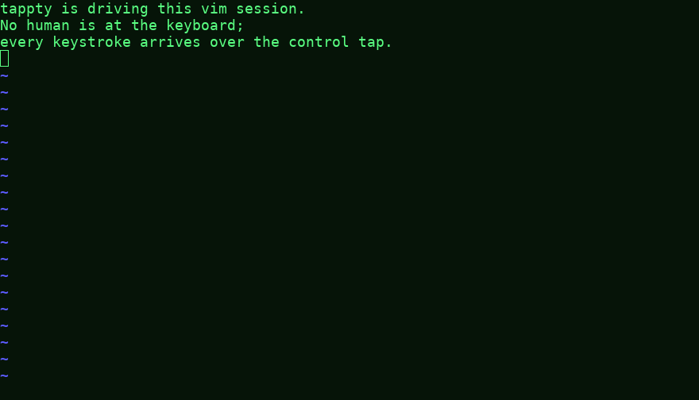
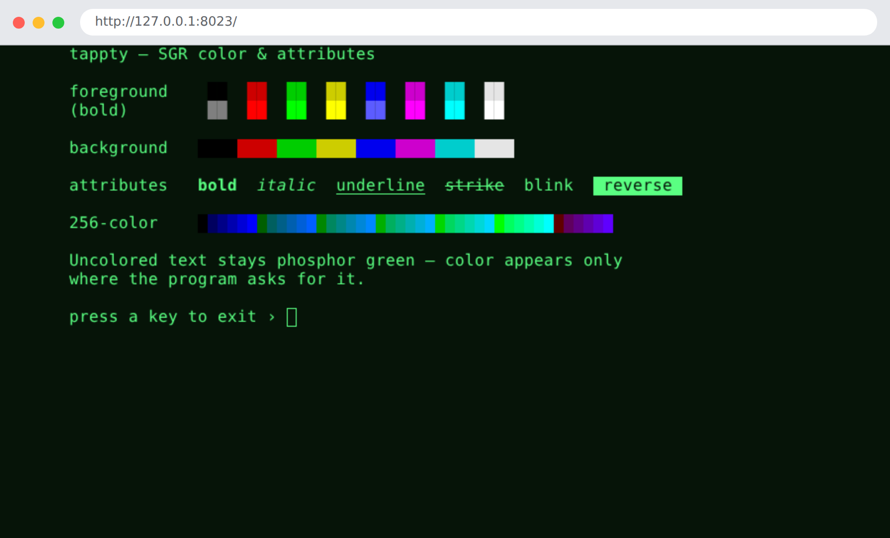

# Gallery

What tappty looks like. Each demo below is a runnable single-file app in
[`demos/`](https://github.com/nyxcraft/tappty/tree/main/demos) — install the GUI and ANSI extras,
run one, and watch:

```sh
pip install 'tappty[sdl,ansi]'
python demos/color_chart.py        # or any demo below
```

The pictures here are rendered headless (`--snapshot out.png`); the movie is rendered straight to
video with `tapterm --render`. Want to *write* code against the API instead of watch it? See the
[coding examples](https://github.com/nyxcraft/tappty/tree/main/examples).

## In motion

`nyancat` hosted in tappty and rendered straight to an **animated GIF** — no terminal, no X11,
just the grid drawn to frames and piped through ffmpeg. It loops, so it moves here *and* in
GitHub's markdown view:


```sh
tapterm --play demos/recordings/nyancat.cast --render nyan.gif --zoom 0.5
```

## A program driving a terminal app

This is what tappty is *for* — observe **and** control. No human touches the keyboard: an
autopilot holds tappty's talking stick and types into a live `vim` over the control tap, while
every renderer/observer watches the same session. Text appears as if typed by a ghost, then
ex-commands run (`:set number`, duplicate a line, jump around). The autopilot is an in-process
thread here, but it only calls `send_input` — the same primitive the bus relays for a *remote*
bot — and it's an `ai` controller, so a human watching the GUI can press a key to take the stick.

<video autoplay loop muted playsinline width="528" style="max-width:100%;border-radius:6px">
  <source src="media/drive_vim.mp4" type="video/mp4">
  
</video>

```sh
python demos/drive_vim.py                          # watch it drive vim live (needs vim)
tapterm --play demos/recordings/drive_vim.cast     # replay the recording (no program needed)
```

That demo drives a *fixed* script. For a closed loop that **reads the screen/stream and decides
what to type next**, see [`examples/watch_and_drive.py`](https://github.com/nyxcraft/tappty/blob/main/examples/watch_and_drive.py).

## In the browser — the web renderer

`web_ui` serves the live terminal as one HTML page: a stdlib `http.server` hands out a single
canvas, the browser paints the styled cells over a websocket and sends your keystrokes back —
several browsers can watch at once, loopback-bound. Below is the SGR color chart rendered in a
**real (headless Chromium) browser tab**, captured with Playwright by `demos/web_demo.py`:



```sh
python demos/web_demo.py                 # serve at http://127.0.0.1:8023/ — then open it
python demos/web_demo.py --shot web.png  # …or screenshot the browser tab headless (Playwright)
tapterm --web -- bash                    # or host any program for the browser
```

## Color & SGR attributes

The full SGR palette — the 8 + 8 colors, backgrounds, **bold**, *italic*, underline, strike,
blink, and reverse, plus a 256-color strip. Uncolored text stays phosphor green; color appears
only where the program asks for it.


`python demos/color_chart.py` · [source →](https://github.com/nyxcraft/tappty/blob/main/demos/color_chart.py)

## Green-phosphor digital rain

Columns of glyphs falling in phosphor green, drawn on the dependency-free VT52 `Terminal` — no
color backend, no external program, just the green the terminal already renders. Here it is as an
mp4 (rendered through the VT52 backend, since this demo speaks VT52, not ANSI):

<video autoplay loop muted playsinline width="440" style="max-width:100%;border-radius:6px">
  <source src="media/matrix.mp4" type="video/mp4">
  
</video>

`python demos/matrix_rain.py` · [source →](https://github.com/nyxcraft/tappty/blob/main/demos/matrix_rain.py)

## Mission control — the compositor

Four independent sessions tiled in one window: the color chart, the digital rain, a live colored
log tail, and a clock with sweeping bars. Each tile is its own hosted program and shows the
`[F2: take control]` affordance — the talking stick that lets a human or a driver take over.


`python demos/mission_control.py` · [source →](https://github.com/nyxcraft/tappty/blob/main/demos/mission_control.py)

## Hosting real terminal programs

tappty hosts any ANSI program faithfully — 256/truecolor SGR, block-glyph art, full-screen TUIs.
The shot below is `cbonsai` **recorded once and replayed here**, so it reproduces with nothing
installed (the movie above is `nyancat`, the same way):


```sh
tapterm --play demos/recordings/cbonsai.cast   # replay the bundled recording (no program needed)
tapterm -- cbonsai -li                         # or host it live (needs cbonsai installed)
```

**Record your own.** `--record` captures the live output stream with timing; replay it anywhere
with `--play`, or turn it into a video with `--render`:

```sh
tapterm --record cmatrix.cast -- cmatrix       # record a live session
tapterm --play cmatrix.cast                    # replay it later (no program needed)
tapterm --play cmatrix.cast --render out.mp4   # …or render it to a movie
```
