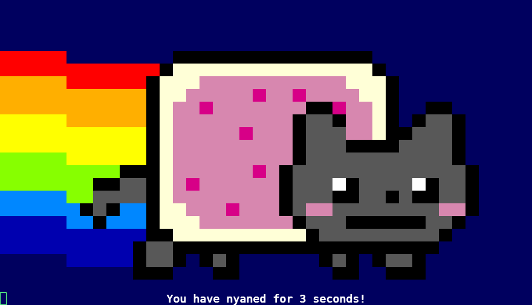
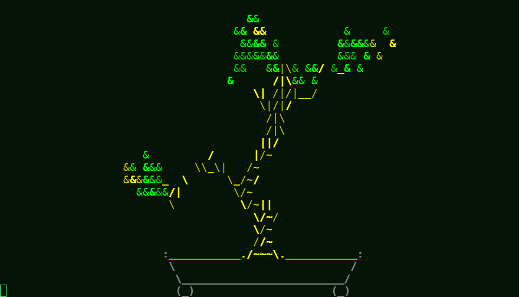

# Gallery

A few things tappty can do — each backed by a **runnable example** you can read and reproduce,
not just a screenshot. Every demo here is in-process (no external program needed) and lives in
[`demos/`](https://github.com/nyxbitco/tappty/tree/main/demos). Install the GUI and ANSI
extras first:

```sh
pip install 'tappty[gui,ansi]'
```

Each example also takes `--snapshot out.png` to render headless and write the PNG instead of
opening a window — that's exactly how the images below were produced.

## Color & SGR attributes

A tiny in-process program prints the full SGR palette — the 8 + 8 colors, backgrounds,
**bold**, *italic*, underline, strike, blink, and reverse, plus a 256-color strip. Uncolored
text stays phosphor green; color appears only where the program asks for it.


```sh
python demos/color_chart.py
```

[View source on GitHub →](https://github.com/nyxbitco/tappty/blob/main/demos/color_chart.py)

<!--include: demos/color_chart.py-->

## Green-phosphor digital rain

An animation drawn on the dependency-free VT52 `Terminal` — columns of glyphs falling in
phosphor green. No color backend, no external program; just the green the terminal already
renders. (It needs only `pip install 'tappty[gui]'`.)


```sh
python demos/matrix_rain.py
```

[View source on GitHub →](https://github.com/nyxbitco/tappty/blob/main/demos/matrix_rain.py)

<!--include: demos/matrix_rain.py-->

## Mission control — the compositor

Four independent sessions tiled in one window by the compositor: the color chart, the digital
rain, a live colored log tail, and a clock with sweeping bars. Each tile is its own hosted
program, and each shows the `[F2: take control]` affordance — the talking stick that lets a
human or a driver take over a tile.


```sh
python demos/mission_control.py
```

[View source on GitHub →](https://github.com/nyxbitco/tappty/blob/main/demos/mission_control.py)

<!--include: demos/mission_control.py-->

## Hosting real terminal programs

tappty hosts any ANSI program faithfully — 256/truecolor SGR, block-glyph art, full-screen
TUIs. The two below are real programs (`nyancat`, `cbonsai`) **recorded once and replayed here**:
the screenshots are produced by replaying bundled `.cast` files, so they reproduce with none of
those programs installed.

### nyancat



```sh
tapterm -- nyancat                                # host it live (needs nyancat installed)
tapterm --play demos/recordings/nyancat.cast   # replay the bundled recording (zero deps)
```

### cbonsai



```sh
tapterm -- cbonsai -li
tapterm --play demos/recordings/cbonsai.cast
```

**Record your own.** `--record` captures the live output stream as it runs; replay it anywhere
with `--play`, no program required:

```sh
tapterm --record cmatrix.cast -- cmatrix     # record a live session
tapterm --play cmatrix.cast                  # replay it later (zero deps)
```

[`chafa`](https://hpjansson.org/chafa/) turns images (and video frames) into truecolor ANSI you
can host the same way — `tapterm -- chafa picture.png`. And tappty's own
[digital rain](#green-phosphor-digital-rain) covers the Matrix effect with no dependencies at all.
