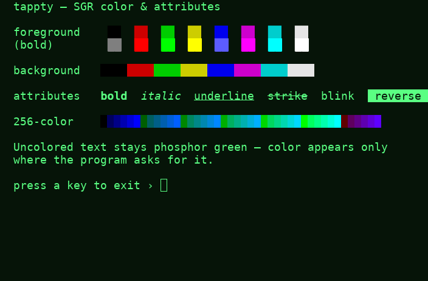
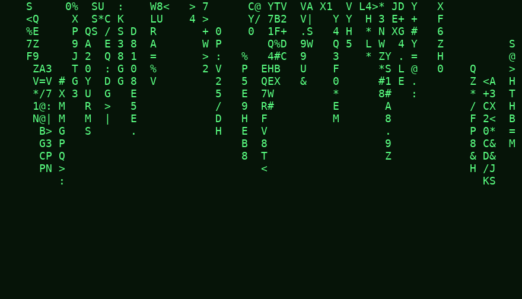
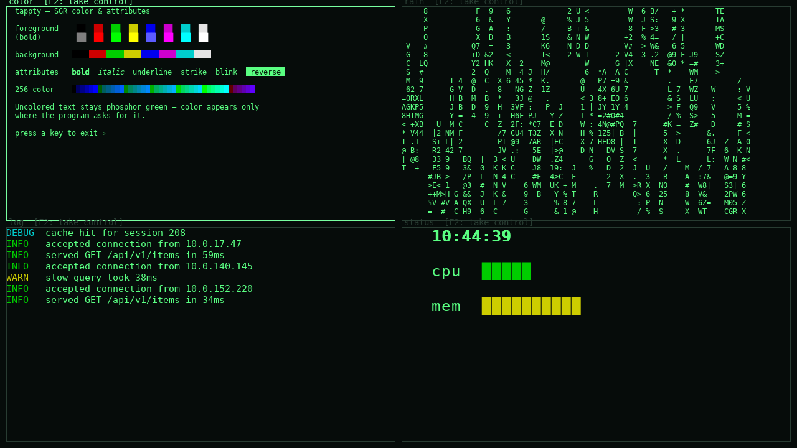

# Gallery

A few things tappty can do — each backed by a **runnable example** you can read and reproduce,
not just a screenshot. Every demo here is in-process (no external program needed) and lives in
[`examples/`](https://github.com/nyxbitco/tappty/tree/main/examples). Install the GUI and ANSI
extras first:

```sh
pip install 'tappty[gui,ansi]'
```

Each example also takes `--snapshot out.png` to render headless and write the PNG instead of
opening a window — that's exactly how the images below were produced.

## Color & SGR attributes

A tiny in-process program prints the full SGR palette — the 8 + 8 colors, backgrounds,
**bold**, *italic*, underline, strike, blink, and reverse, plus a 256-color strip. Uncolored
text stays phosphor green; color appears only where the program asks for it.



```sh
python examples/color_chart.py
```

[View source on GitHub →](https://github.com/nyxbitco/tappty/blob/main/examples/color_chart.py)

<!--include: examples/color_chart.py-->

## Green-phosphor digital rain

An animation drawn on the dependency-free VT52 `Terminal` — columns of glyphs falling in
phosphor green. No color backend, no external program; just the green the terminal already
renders. (It needs only `pip install 'tappty[gui]'`.)



```sh
python examples/matrix_rain.py
```

[View source on GitHub →](https://github.com/nyxbitco/tappty/blob/main/examples/matrix_rain.py)

<!--include: examples/matrix_rain.py-->

## Mission control — the compositor

Four independent sessions tiled in one window by the compositor: the color chart, the digital
rain, a live colored log tail, and a clock with sweeping bars. Each tile is its own hosted
program, and each shows the `[F2: take control]` affordance — the talking stick that lets a
human or a driver take over a tile.



```sh
python examples/mission_control.py
```

[View source on GitHub →](https://github.com/nyxbitco/tappty/blob/main/examples/mission_control.py)

<!--include: examples/mission_control.py-->
